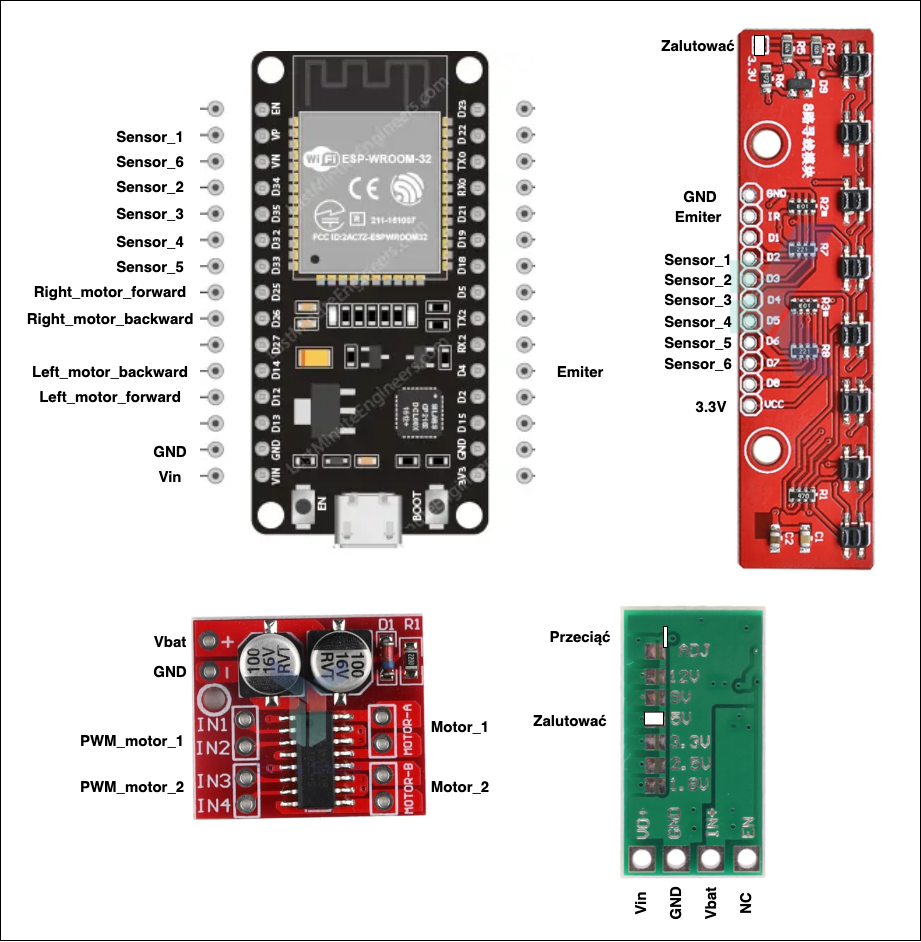

# LINE FALLOWER TO RULE THEM ALL
Pierwsza wersja ulepa LFa autorstwa Filip Skawiński

## HOW TO

Aplikację zaimportować do MIT APP Inventor, skompilować i zainstalować na telefonie.
Ewentualnie zainstalować .apk z repo.

Po podłączeniu do AP robota albo robota do sieci WiFi kliknąć Start na górze aplikacji. Jeżeli robot działa to przycisk zmieni kolor na zielony.
Robota należy skalibrować co trwa parenaście sekund a potem już można się bawić.

## Parametry

- Kp: Wartość proporcji regulatora PID,
- Ki: Wartość całki (nie dużo daje, wartość bardzo mała np. 0.001)
- Kd: Wartość pochodnej. Należy pamiętać, że Kd > Kp. Różne są metody ale u mnie działa np 2*Kp, 7*Kp.
- BaseSpeed: szybkość skręcania robota podczas działanie algorytmu PID.
- MaxSpeed: prędkość gdy robot jedzie w prostej linii
- TurnSpeed: prędkość gdy robot wyjedzie za linie i próbuje wrócić

## schemat podłączeń

## Rady Norberta

Zrobić czujniki w konfiguracji 1,3,4,5,6,8

## TO DO
- schemat podłączeń
- BOM
- komentarze
